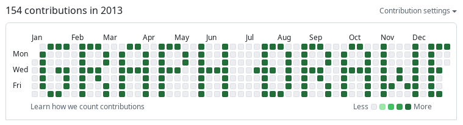
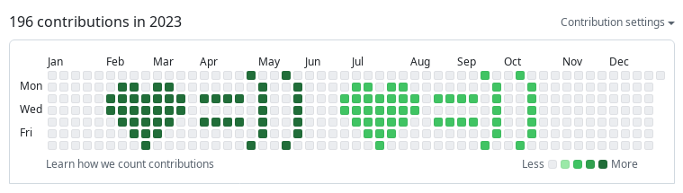
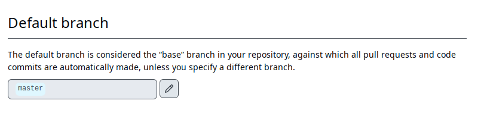
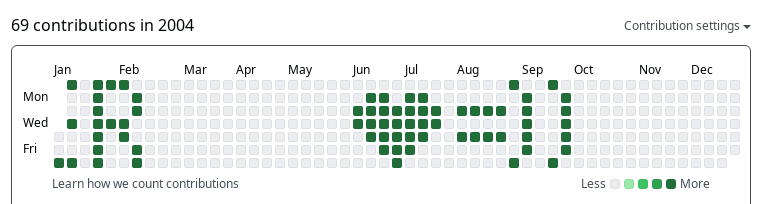
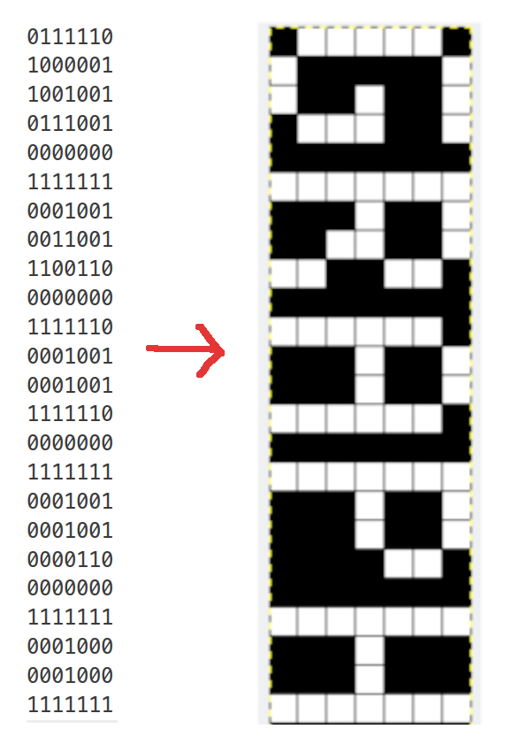

# Graph Drawer

A simple python script two draw on your contribution graph. Checkout the real
example
[here](https://github.com/kienvo?tab=overview&from=2003-12-01&to=2003-12-31) and
[here](https://github.com/kienvo?tab=overview&from=2004-12-01&to=2004-12-31).





This is an example to prove that people shouldn't overrated a person by his/her
contribution graph.

## Usage

### Dependencies

git and python3 and an input file (see [Input file format](#input-file-format)).

### Download main.py or clone this repo on your local machine

```console
git clone https://github.com/kienvo/graph-drawer
```

### Write empty commits to your local .git

```console
main.py -i example.txt -d 2004-06-07T00:00:00+00:00
```

Or you may want to run in another working tree:

```console
main.py -i example.txt -d 2004-06-07T00:00:00+00:00 --git-dir=../path/to/.git
```

More explainations:

```console
$ python3 main.py -h
usage: graph-drawer [-h] [-i INPUT_FILE] [-d START_DATE]

options:
  -h, --help            show this help message and exit
  -i INPUT_FILE, --input-file INPUT_FILE
                        path to the input file.
  -d START_DATE, --start-date START_DATE
                        date to start drawing in iso 8601 format e.g., 2014-01-07T02:00:00+70:00
```

You may want to choose START_DATE on Monday if the year is before 2010(*) or on
Sunday if the year is after. Github shift a day if the year is before 2010 for
unknown reason.

(*) I don't remember exactly =]].

### Push your local git to Github

```console
git push origin your-default-branch
```

You may want to use the `--force` if the branch head was modified.

### Checkout your contribution graph

Make sure the commits in your branch is set as default in repo setting,
otherwise nothing will display on your graph.



Voilà:




### Input file format

Look at [example.txt](example.txt) and rotate it +90 degree:


